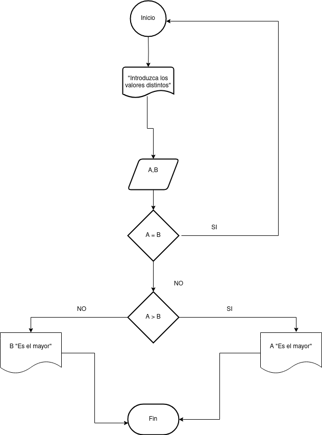

# Ejercicios

- [Ejercicio 1](#ejercicio1)

## Ejercicio 1 

Desarrolle un algoritmo que permita leer dos valores distintos, determinar cual de los dos valores es el mayor y escribirlo.

### Diagrama de Flujo

### Diagrama Pseudocódigo

Pasos:
 - Inicio
 - Inicializar variables: __A = 0, B = 0__
 - Solicitar la introducción de dos
valores distintos
 - Leer los dos valores
 - Asignarlos a las variables __A y B__
 - Si A = B Entonces vuelve a 3
porque los valores deben ser
distintos
 - Si __A > B__ Entonces
Escribir A, “Es el mayor”
 - De lo contrario: Escribir ___B, “Es
el mayor”___
 - Fin_Si
 - Fin

